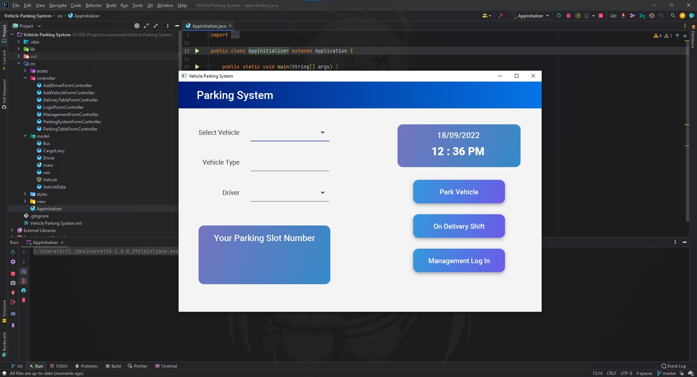
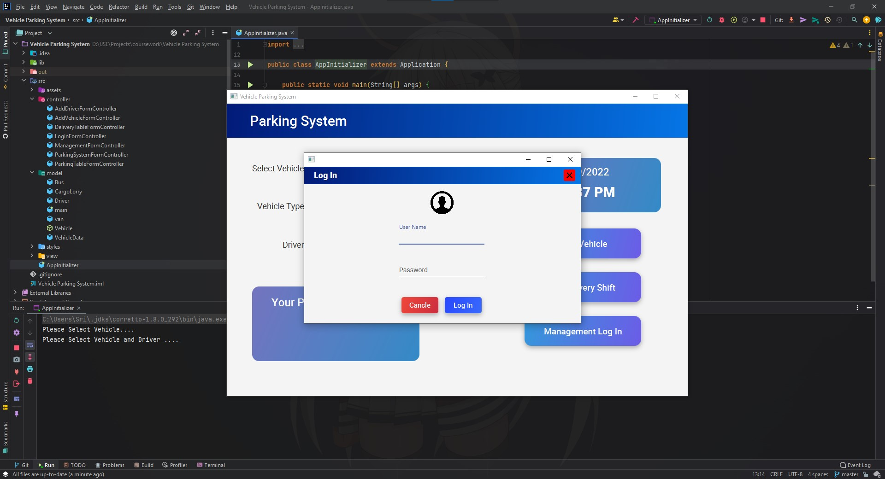
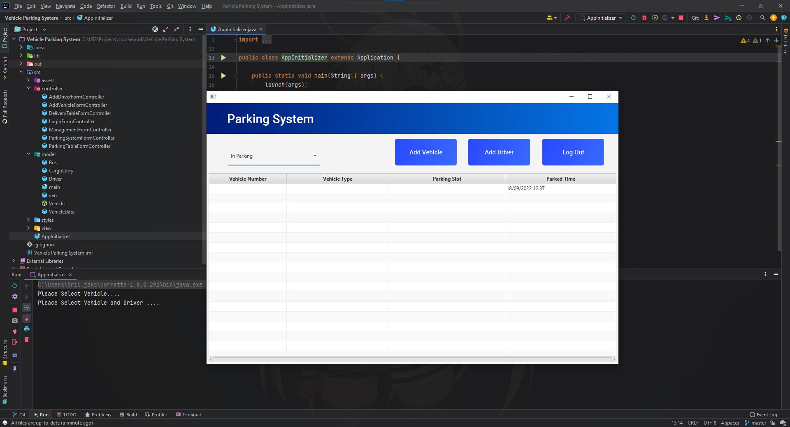
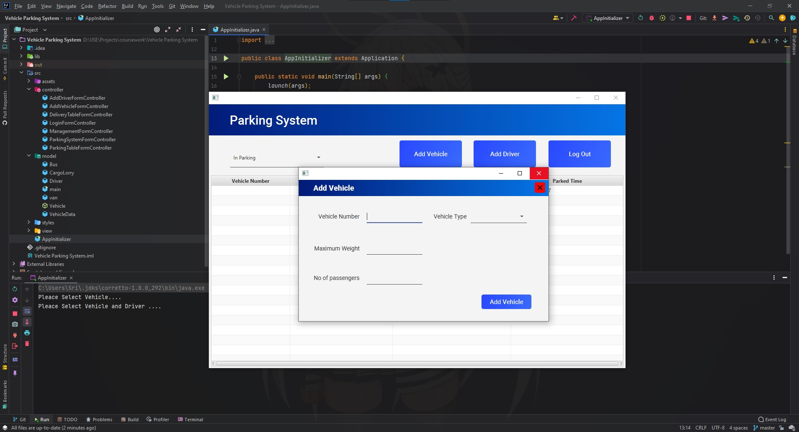
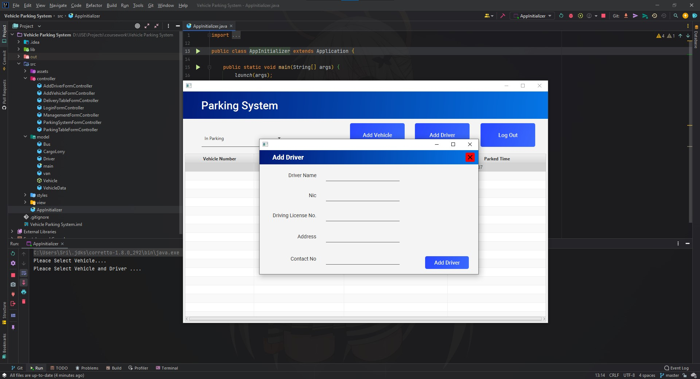
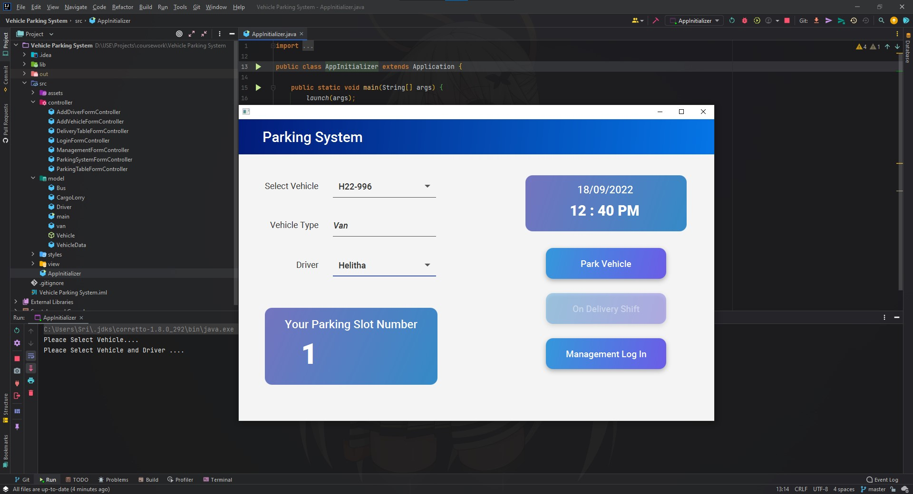
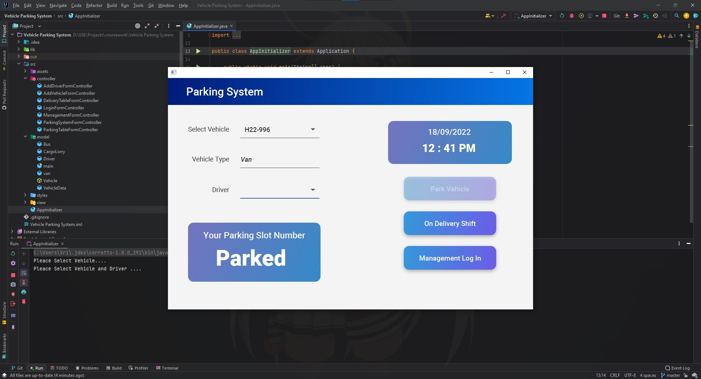

# In Memory Vehicle Parking System

### This project's objective is to solve the parking problem in Saman Rice Company. They have a basement parking stand, but the problem is that parking has only a small area. The Stand can park only 14 vehicles at a time. So I decided to make a system to generate parking slot numbers to solve this problem.

## Tools & Technologies
* Java
* JavaFX
* CSS

